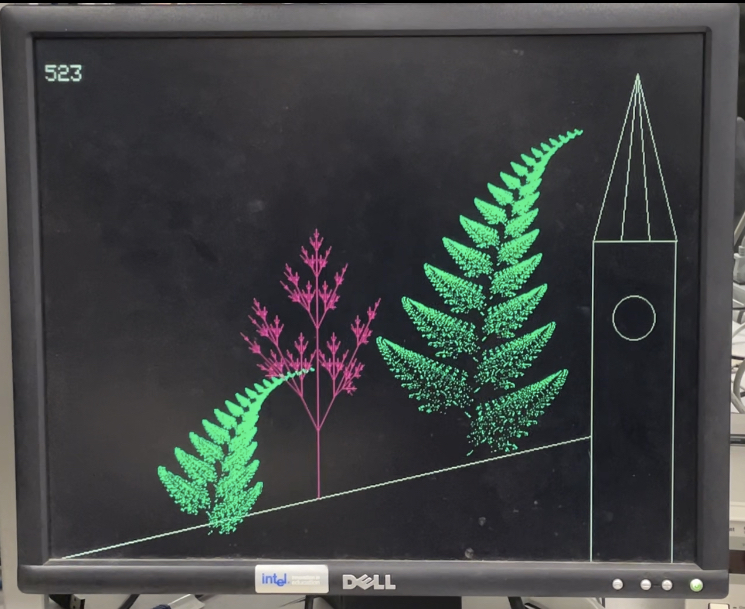

# ECE-5730-Project-Tree-Generation
Project of ECE 5730 - Digital Systems Design Using Microcontrollers, Fall 2022, Cornell University

This project is a combination of visual and audio components, simulating beautiful landscapes of Conrell west slope on the VGA screen and taking music as inputs from microphone to generate trees with different colors and shapes. 

Specifically, the implementation uses Barnsley Fern and L-System algorithm to generate trees with various fractal shapes. FFT was used to extract features from the audio input. Demo video in /assets.

This project is intended to be used on RP2040, modifications may be required on other hardware.

